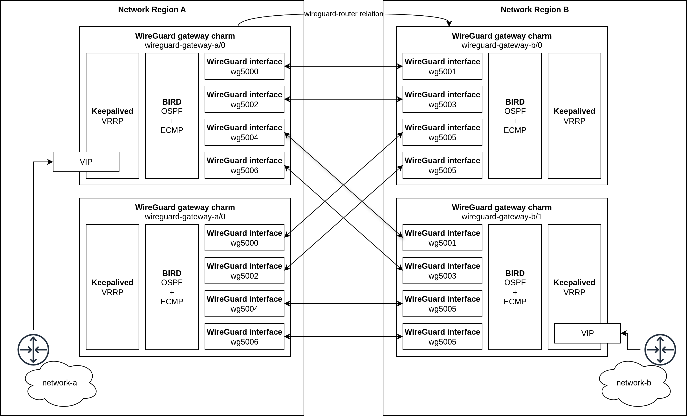

(explanation_charm_architecture)=

# Charm architecture

At its core, the WireGuard gateway charm is a highly available, high-performance site-to-site VPN solution that can be used to connect multiple network environments.

It uses WireGuard, a modern and secure VPN protocol, to provide encrypted and authenticated tunnels. It also uses BIRD and Keepalived to provide network high availability and link redundancy using OSPF, ECMP, and VRRP.

## High-level overview of WireGuard gateway charm deployment

The following diagram shows a typical deployment of the WireGuard gateway charm in three separate network environments, each containing a WireGuard gateway charm. The three WireGuard gateway charms are integrated with charm relations and forward traffic between the three network environments through encrypted WireGuard tunnels.

```{mermaid}
C4Context
    title WireGuard gateway charm deployment
    Boundary(network-a, "Network A") {
        Component(wireguard-a, "WireGuard gateway")
    }
    Boundary(network-b, "Network B") {
        Component(wireguard-b, "WireGuard gateway")
    }
    Boundary(network-c, "Network C") {
        Component(wireguard-c, "WireGuard gateway")
    }
    Rel(wireguard-a, wireguard-b, "WireGuard router relation")
    Rel(wireguard-c, wireguard-b, "WireGuard router relation")
    Rel(wireguard-a, wireguard-c, "WireGuard router relation")
    UpdateRelStyle(wireguard-a, wireguard-b, $offsetY="-50", $offsetX="-40")
    UpdateRelStyle(wireguard-a, wireguard-c, $offsetY="-50", $offsetX="-40")
```

## Charm architecture

The following diagram shows the architecture of the WireGuard gateway charm:



## Metrics

The WireGuard gateway charm provides Prometheus metrics. The full list of metrics can be found [here](../reference/metrics.md).

## Juju events

For this charm, the following Juju events are observed:

1. {ref}`config-changed <juju:hook-config-changed>`
2. {ref}`upgrade-charm <juju:hook-upgrade-charm>`
3. {ref}`update-status <juju:hook-update-status>`
4. {ref}`wireguard-router-a-relation-changed <juju:hook-relation-changed>`
5. {ref}`wireguard-router-a-relation-broken <juju:hook-relation-broken>`
6. {ref}`wireguard-router-a-relation-joined <juju:hook-relation-joined>`
7. {ref}`wireguard-router-a-relation-departed <juju:hook-relation-departed>`
8. {ref}`wireguard-router-b-relation-changed <juju:hook-relation-changed>`
9. {ref}`wireguard-router-b-relation-broken <juju:hook-relation-broken>`
10. {ref}`wireguard-router-b-relation-joined <juju:hook-relation-joined>`
11. {ref}`wireguard-router-b-relation-departed <juju:hook-relation-departed>`

During all of those events, the charm runs the same reconciliation process to update the configuration, including relation data, WireGuard configuration, BIRD configuration, and Keepalived configuration, based on the current charm configuration and remote relation data.

```{note}
See more in the Juju docs: {ref}`juju:hook`
```

## Charm code overview

The `src/charm.py` file is the default entry point for the WireGuard gateway charm. It creates an instance of the `Charm` class, which inherits from `ops.CharmBase`. `ops.CharmBase` is the base class from which all charms are derived, provided by [Ops](https://ops.readthedocs.io/en/latest/index.html) (the Python framework for developing charms).

```{note}
See more in the Juju docs: {ref}`juju:charm`
```

The `__init__` method of `Charm` ensures that the charm observes
and handles all events relevant to its operation.

For example, when a configuration is changed using the CLI:

1. The user runs the configuration command:

```bash
juju config wireguard-gateway advertise-prefixes="10.0.0.0/8"
```

2. A `config-changed` event is emitted.
3. In the `__init__` method, the handler for this event is defined as follows:

```python
self.framework.observe(self.on.config_changed, self.reconcile)
```

4. The `reconcile` method, in turn, takes the necessary actions, such as updating relation(s) and updating WireGuard/BIRD/Keepalived configurations.
